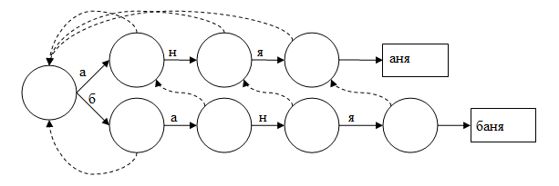
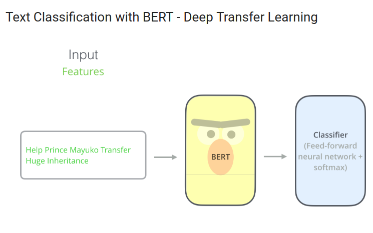

## Оценка восприятия акций на основе новостей из профильных telegram-каналов

Задача: найти упоминания компаний из определенного списка в тексте и для каждой компании предсказать тональность её упоминания.

Запуск решения

```bash
python download_model.py
python run_me.py
```


## Решение ##
Решение состоит из двух частей: 

1) Поиск упоминаний компаний

2) Определение тональности упоминания компании

Часть 1: Поиск упоминаний компаний (Named entity recognition)

Так как список компаний не очень большой, а классические решения задачи NER весьма тяжеловесны (используют нейросетевые подходы), мы использовали строковые алгоритмы.

Чтобы применять строковые алгоритмы мы генерируем список синонимов и форм слова для каждого названия компании. Для этого используем 
pymorhy
 и gpt. Расширенный список синонимов хранится в 
final_solution/ner/new_names_and_synonyms.csv
.

Далее с помощью алгоритма Ахо-Корасик находим все упоминания синонимов в тексте сообщений.



Часть 2: Определение тональности упоминания компании (Aspect based entity recognition)

Идея этой части заключается в fine-tuning'e предобученной большой языковой модели.

В качестве предобученной модели используется основная модель LLM - она используется получения эмбеддингов, а кастомный classification head выдаёт вероятности для каждого класса тональности.



В качестве основной модели применялся rubert-tiny2, а classifcation head состял из двух линейных слоёв + softmax.

Для реализации использовалась бибилотека 
transofrmers
. Веса модели можно найти на huggingface: [ссылка](huggingface.co/ganjubas2008/absa-rubert-tiny).

Результаты

* f1score для выделения компаний на валидации: 0.71

* accuracy для определения тональности упоминания компании на валидации: 0.66